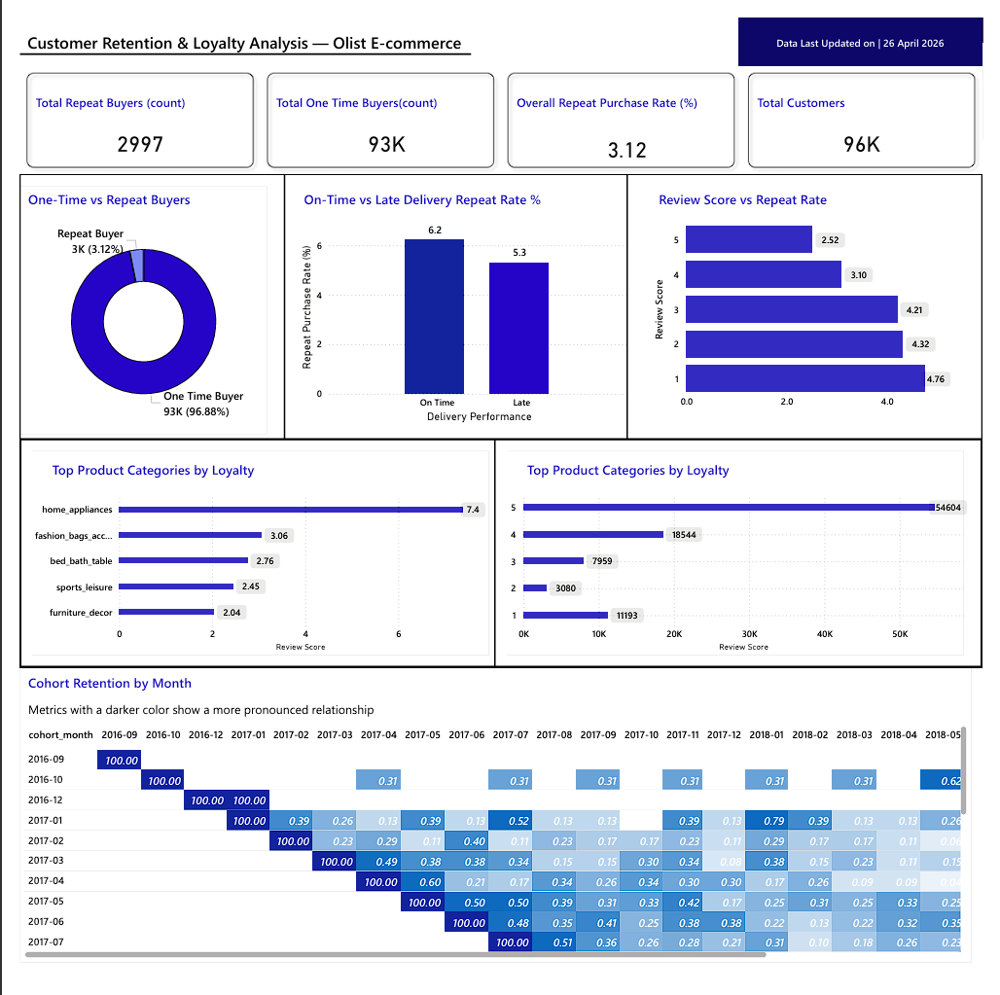

# 🛒 Customer Retention & Loyalty Analysis — Olist E-commerce

> **Role:** Product Analyst · Growth Analyst | **Tools:** SQL · Power BI · SQLite
> **Dataset:** 96K+ customers · 100K+ orders · 2016–2018

---

## 📌 Business Context

Olist is a Brazilian e-commerce marketplace connecting small 
merchants to major retail channels. Despite acquiring over 96,000 
customers, the business faced a critical growth challenge — 
customer acquisition costs were rising while repeat purchase 
rates remained dangerously low.

The product team needed to answer one fundamental question:

> *"Why are customers not coming back — and what can we do about it?"*

---

## ❗ Problem Statement

Olist's retention rate was significantly below industry benchmarks. 
Without understanding the behavioral drivers behind customer churn, 
the product team could not prioritize the right interventions to 
improve platform stickiness and long term revenue growth.

---

## 🎯 Objective

Conduct an end-to-end product analytics investigation to:

- Measure the platform's repeat purchase rate
- Identify when customers drop off using cohort analysis
- Determine whether delivery experience impacts retention
- Understand the relationship between satisfaction and loyalty
- Identify which product categories drive the most loyal customers

---

## 🛠️ Tools & Technologies

| Tool | Purpose |
|---|---|
| SQL (SQLite) | Data extraction, transformation, analysis |
| DB Browser for SQLite | Query execution & data exploration |
| Power BI | Interactive dashboard & visualization |
| DAX | Calculated measures & KPIs |
| Mockup.ai| Dashboard Wireframing |

---

## 📁 Dataset

**Source:** Olist Public E-commerce Dataset

| Table | Rows | Description |
|---|---|---|
| olist_customers_dataset | 99,441 | Customer & location info |
| olist_orders_dataset | 99,441 | Order status & timestamps |
| olist_order_items_dataset | 112,650 | Items per order |
| olist_order_payments_dataset | 103,886 | Payment details |
| olist_order_reviews_dataset | 100,000+ | Customer review scores |
| olist_products_dataset | 32,951 | Product & category info |

---

## 🔍 Analysis Framework

### Q1 — Repeat Purchase Rate
> *"What percentage of customers ever made a second purchase?"*

**Metric:** Repeat Purchase Rate
**Approach:** Grouped customers by unique ID, counted orders per customer, 
segmented into one-time vs repeat buyers

### Q2 — Cohort Retention Analysis
> *"Of customers who first purchased in a given month, how many returned?"*

**Metric:** Monthly Cohort Retention Rate
**Approach:** Assigned customers to cohorts by first purchase month, 
tracked return purchases month over month

### Q3 — Delivery Experience Impact
> *"Does late delivery reduce the likelihood of a repeat purchase?"*

**Metric:** Retention Rate by Delivery Status
**Approach:** Compared estimated vs actual delivery dates, 
labeled orders as On Time or Late, measured repeat rate for each group

### Q4 — Customer Satisfaction vs Retention
> *"Do customers who gave high review scores return more often?"*

**Metric:** Repeat Purchase Rate by Review Score
**Approach:** Joined review scores to customer purchase history, 
measured retention rate across each star rating

### Q5 — Product Category Loyalty
> *"Which categories generate the most loyal repeat customers?"*

**Metric:** Category Repeat Purchase Rate
**Approach:** Mapped purchases to product categories via translation table, 
calculated repeat rate per category, ranked by loyalty

---

## 📊 Key Findings

### Finding 1 — Critical Retention Gap
> Only **3.12%** of 96,000+ customers ever made a repeat purchase — 
> compared to an industry average of 20–30%

### Finding 2 — Retention Drops Instantly
> Cohort analysis revealed that no customer cohort retained more than 
> **1% of users by month 2** — confirming a platform wide retention 
> problem not limited to any specific time period

### Finding 3 — Delivery Impacts But Does Not Explain Retention
> Late delivery customers had a **5.28%** repeat rate vs **6.21%** 
> for on-time customers — delivery is a contributing factor but 
> not the primary driver of churn

### Finding 4 — Satisfaction Does Not Predict Loyalty
> Counterintuitively, **1-star reviewers returned more (4.76%)** than 
> 5-star reviewers (2.52%) — suggesting purchase intent is driven 
> by factors beyond satisfaction scores

### Finding 5 — Category Loyalty Varies Significantly
> **Home Appliances** had the highest repeat rate at **7.4%** — 
> more than double the platform average — while high volume 
> categories like Health & Beauty (1.74%) underperformed

---

## 💡 Recommendations

**1. Launch Category Specific Loyalty Program**
> Home Appliances shows 7.4% repeat rate — 2x platform average. 
> Build loyalty rewards targeting this category and apply learnings 
> to high volume categories like Health & Beauty.

**2. Investigate Post Purchase Experience**
> Since satisfied customers don't return more than dissatisfied ones, 
> the retention problem lies beyond product quality — likely in 
> post purchase communication, re-engagement and discovery.

**3. Improve Delivery SLA**
> Late deliveries reduce retention by ~1%. While not the primary 
> driver, improving delivery experience will have compounding 
> positive effects on overall platform trust.

**4. Re-engagement Campaigns**
> Since 96.88% of customers never return, implement triggered 
> email/push campaigns at Day 7, Day 30 post purchase targeting 
> lapsed customers with personalized recommendations.

---

## 📸 Dashboard

---

## 📂 Project Structure
olist-retention-analysis/
├── Q1_repeat_purchase_rate.sql
├── Q2_cohort_retention.sql
├── Q3_delivery_impact.sql
├── Q4_review_vs_retention.sql
├── Q5_category_loyalty.sql
└── dashboard.png 

---

## 👤 Author

**Shourya Sarraf**
Product Analyst | Data Analytics | SQL · Power BI · Mixpanel

🔗 [LinkedIn](https://linkedin.com/in/shourya-sarraf-7b9735398)
📧 shourya.sarraf933@gmail.com

---

*This project was completed as part of a self-directed product 
analytics portfolio to demonstrate end-to-end analytical thinking 
from raw data to actionable recommendations.*
